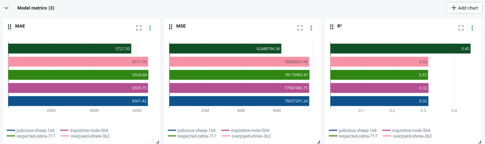

# M3 - Brief 2 - Étendre la base de données pour intégrer de nouvelles sources

## Analyse nouveau fichier de données

Le fichier comporte 3 nouvelles colonnes : _orientation_sexuelle_, _nb_enfants_ et _quotient_caf_
**orientation_sexuelle** est à écarter, car totalement contraire à la RGPD
**nb_enfants** contients des valeurs abhérantes (valeurs négative) et son utilité est discutable
**quotient_caf** est une donnée financière et sociale, assez sensible, mais peut être très utile pour prédire le montant d'un prêt

Je choisi donc d'ajouter les colonnes _nb_enfants_ et _quotient_caf_ à la table **clients**, en nullable pour ne pas casser l'API et rester compatible avec les anciennes données.

## Synthèse
### Nettoyage des données
J'avais prévu dans le brief 1 une traitement générique des colonnes suivants le type numérique ou catégoriel. Cela permet d'ajouter de nouvelles colonnes simplement en donnant leur nom et leur type. Je gère également le cas où des ancinnes colonnes ne serait plus disponibles.
Cependant, pour nb_enfants par exemple, j'ai due ajouter une validation logique supplémentaire pour corriger les valeurs impossibles. L’IQR détectant uniquement les valeurs aberrantes statistiques.

J'ai donc ajouté la fonction suivante pour gérer les règles métier :

```
def correct_business_rules(df):
    # nb_enfants ne peut pas être négatif
    if "nb_enfants" in df.columns:
        df["nb_enfants"] = df["nb_enfants"].clip(lower=0)

    # quotient_caf ne peut pas être négatif
    if "quotient_caf" in df.columns:
        df["quotient_caf"] = df["quotient_caf"].clip(lower=0)

    return df
```

### Performances

Nous pouvons constater qu'avec ces nouvelles données, les performances du modèles sont meilleures :


